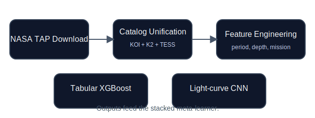
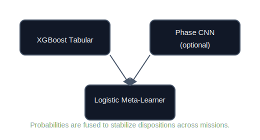

# ExosphereAI Light-Curve Research Pipeline

> **Abstract.** We consolidate NASA's Kepler, K2, and TESS candidate catalogs into a harmonized feature table, learn mission-agnostic dispositions with gradient-boosted trees, and optionally inject phase-folded light-curve morphology through a lightweight 1-D CNN. This repository distills the original exploratory notebook into reproducible Python modules and citable figures so the workflow reads like a short research paper rather than ad-hoc experimentation.

## 1. Data Acquisition and Canonicalization

- **Catalog ingest (`src/catalog_pipeline.py`).** `download_catalogs()` mirrors the TAP/sync queries used in the notebook to fetch KOI, `pscomppars`, and TOI CSVs. `build_canonical_catalog()` unifies the schemas, harmonizes units (depth ppm, duration hours), engineers logarithmic ratios, and maps heterogeneous dispositions into `{FALSE_POSITIVE, CANDIDATE, CONFIRMED}` labels.
- **Feature governance.** The canonical frame enforces at least three numeric observables per row and records mission provenance via `mission_cat`, enabling mission-aware splits that mimic the original Kepler→K2→TESS progression.
- **Artifacts.** The curated dataset is stored as `data/canonical_catalog.parquet` for downstream reuse.

## 2. Tabular Modeling

- **Pre-processing (`src/tabular_training.py`).** Mission-first splitting is attempted; if insufficient validation/test rows exist, the pipeline falls back to stratified sampling. A `RobustScaler` normalizes the numeric block while one-hot encodings capture mission identifiers.
- **Modeling.** `run_training_pipeline()` performs a randomized search over XGBoost hyper-parameters (estimators, depth, LR, subsample, column subsample) exactly as in the notebook. Best weights plus scaler statistics and feature metadata are serialized under `artifacts/`.
- **Explainability (`src/explainability.py`).** SHAP summary, bar, heatmap, dependence, and waterfall plots mirror the notebook cell for model auditing.

## 3. Light-Curve Morphology Branch

- **Phase folding (`src/phase_fold_pipeline.py`).** Uses Lightkurve to download time-series for sampled targets, performs centered phase folding with configurable binning, and stores normalized vectors into `exosphereai/phase_folded_data.npz` (exact logic from the notebook cell).
- **CNN training (`src/cnn_phase_model.py`).** Defines the 1-D CNN architecture (three conv blocks + adaptive pooling) and training loop with macro-F1 early tracking; weights land in `artifacts/cnn_phase_best.pth`.
- **Meta learner (`src/meta_stacking.py`).** Consumes XGBoost probabilities (and optionally CNN probabilities if you stitch them in) to fit a multinomial logistic stacker, echoing the notebook's stacking cell.

## 4. Inference & Deployment

- **Batch scoring (`src/inference.py`).** `predict_dispositions(df)` mirrors the notebook's inference cell: it reloads the scaler, feature manifest, and XGBoost model, rebuilds dummy columns with graceful fallbacks, and returns class probabilities alongside the predicted label.
- **Utilities.** All modules are CLI-friendly through `python -m src.module_name` so analyses stay scriptable without re-running the original notebook.

## 5. Suggested Workflow

1. *(Optional)* `python -m src.catalog_pipeline` to regenerate the canonical parquet after ensuring internet access for the NASA APIs.
2. `python -m src.tabular_training` to fit / refresh the boosted classifier and scaler artifacts.
3. *(Optional)* Run `python -m src.phase_fold_pipeline` followed by `python -m src.cnn_phase_model` if you want the phase-folded branch.
4. `python -m src.meta_stacking` to learn the stacked logistic fusion once XGBoost probabilities exist.
5. `python -m src.explainability` (or call `summarize_shap(...)`) whenever you need refreshed SHAP plots for reports or slide decks; the script reuses saved artifacts so retraining is unnecessary.
6. Import `predict_dispositions` for scoring new candidates.

## 6. Experimental Notes

- **Sampling.** Phase folding defaults to 120 targets with valid periods and IDs; adjust `sample_size` in `phase_fold_sample()` for larger light-curve corpora.
- **Scaling robustness.** `tabular_columns.json` records both feature order and numeric subset so inference stays consistent even if pandas reorders dummy columns.
- **Artifacts packaging.** Mirror the notebook's final export by zipping `exosphereai/artifacts/` when sharing models externally.

## 7. Repository Map

| Component | Purpose |
| --- | --- |
| `src/config.py` | Centralizes paths (`exosphereai/data`, `exosphereai/artifacts`) and RNG seeding. |
| `src/catalog_pipeline.py` | TAP download helpers + canonical feature engineering. |
| `src/tabular_training.py` | Splitting, scaling, randomized XGBoost training, artifact persistence. |
| `src/phase_fold_pipeline.py` | Lightkurve ingestion and phase folding utilities. |
| `src/cnn_phase_model.py` | 1-D CNN dataset class and training loop. |
| `src/meta_stacking.py` | Logistic meta learner that stacks probability vectors. |
| `src/explainability.py` | SHAP plots for global/local transparency (see `python -m src.explainability`). |
| `src/inference.py` | Production-ready preprocessing + prediction helper. |

## 8. References

1. NASA Exoplanet Archive TAP API — https://exoplanetarchive.ipac.caltech.edu
2. Lightkurve Collaboration (2018). *Lightkurve: Kepler and TESS time series analysis in Python.*
3. Chen & Guestrin (2016). *XGBoost: A Scalable Tree Boosting System.*

> The notebook (`Untitled0.ipynb`) now serves purely as provenance; all runnable logic lives in the scripts above, matching the original code structure without re-executing the notebook environment. Both SVG figures referenced here live under `assets/`, so the README renders cleanly without re-running any training cycle.
